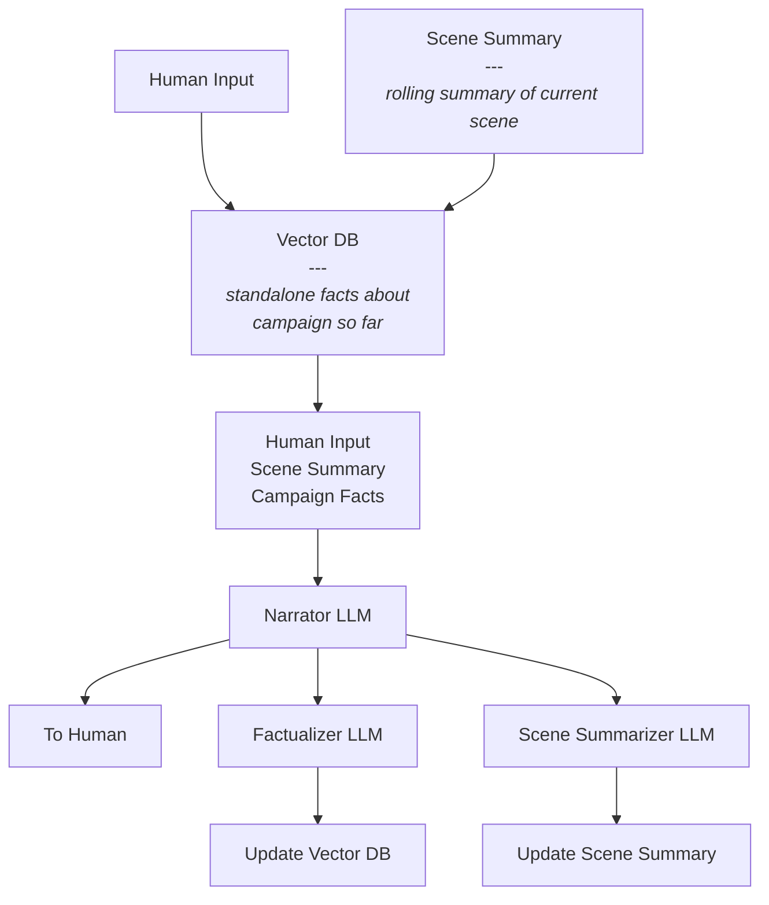

# AI-DM: AI Dungeon Master

I'm building an AI-powered Dungeon Master because I'm tired of always being the DM when I play with my family!

The biggest challenge I've encountered is maintaining a consistent story over a long campaign, solving this is my primary focus. Hopefully, once these is reasonably solved for I can start to iterate on the design, possibly training / fine tuning / distilling smaller, more efficient models.

## Considerations

- Entire system needs to run locally on 32GB M1 MacBook Pro.
- Context window must be kept as small as possible while maintaining coherency of long campiagn and current scene.

## Approach

Instead of relying on a single model, my plan is to use several smaller models.

### Components

- Vector Database: Stores key campaign facts for long-term consistency.
- Scene Summary: Maintains a rolling summary of the current scene.
- Narrator LLM: Generates the next part of the adventure based on inputs and campaign context.
- Factualizer LLM: Extracts stand alone facts from last Narrator LLM output and updates/add/deletes them in Vector DB.
- Scene Summarizer LLM: Updates the rolling scene summary.
